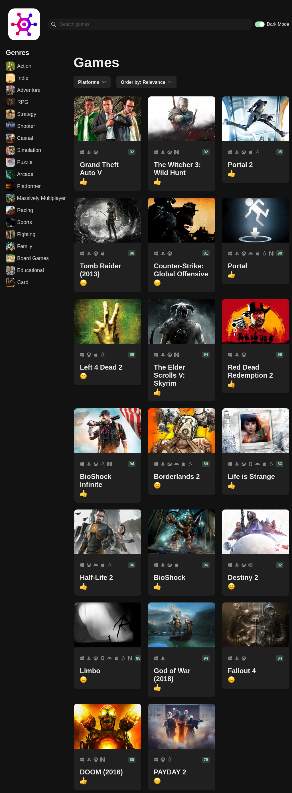

# Izteem gamehub

Welcome to the Game Marketplace Platform, a simple web application built using React and TypeScript that provides access to game information through the RAWG API.

## Features

- Browse and search for games using the RAWG API.
- View detailed information about each game, including release date, platform, and description.
- User-friendly UI built with Chakra UI and styled-components.
- Smooth animations and transitions powered by framer-motion.
- Form handling and validation with react-hook-form.
- Strongly typed codebase using TypeScript and Zod for validation.
- Efficient development environment with Vite.

## UI Screenshot

Here's a glimpse of the user interface:

## Tech Stack
Drakkarrr/izteem-gamehub is built on the following main stack:
-  [React](https://reactjs.org/) – Javascript UI Libraries
-  [JavaScript](https://developer.mozilla.org/en-US/docs/Web/JavaScript) – Languages
-  [TypeScript](http://www.typescriptlang.org) – Languages
-  [ESLint](http://eslint.org/) – Code Review
-  [axios](https://github.com/mzabriskie/axios) – Javascript Utilities & Libraries
-  [styled-components](https://styled-components.com) – JavaScript Framework Components
-  [Prettier](https://prettier.io/) – Code Review

## Installation

1. Clone the repository: `git clone https://github.com/your-username/game-marketplace.git`
2. Navigate to the project directory: `cd game-marketplace`
3. Install dependencies: `npm install`

## Usage

1. Obtain an API key from the [RAWG API](https://rawg.io/apidocs) and add it to your environment.
2. Start the development server: `npm run dev`
3. Open your browser and go to `http://localhost:3000`
